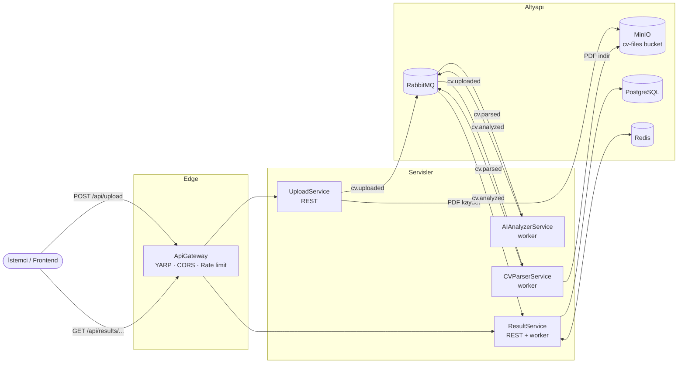
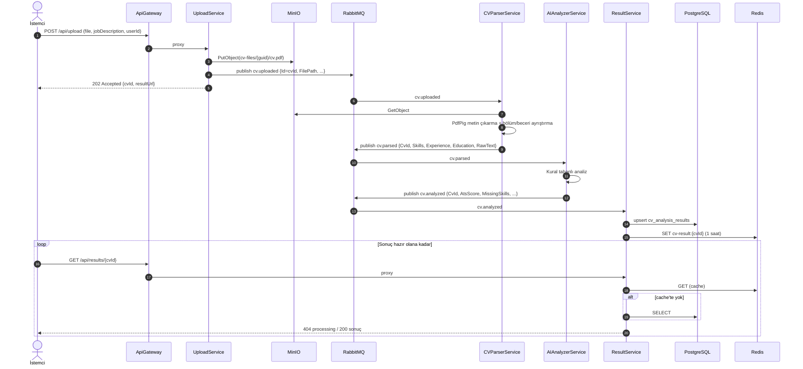

# CV Analyzer

PDF formatındaki bir CV'yi bir iş ilanına göre analiz eden, **ATS uyum puanı**, **eşleşen / eksik beceriler**, ve **iyileştirme önerileri** üreten, .NET 9 ile yazılmış **olay güdümlü (event-driven) mikroservis** uygulaması.

```
PDF + iş ilanı  ──►  Upload  ──►  Parse  ──►  AI Analiz  ──►  Sonuç (PostgreSQL + Redis)  ──►  GET /api/results/{cvId}
```

---

## İçindekiler

1. [Mimari](#mimari)
2. [Servisler](#servisler)
3. [Uçtan uca akış](#uçtan-uca-akış)
4. [Mesaj sözleşmeleri (event'ler)](#mesaj-sözleşmeleri-eventler)
5. [Kullanılan mimari desenler ve kararlar](#kullanılan-mimari-desenler-ve-kararlar)
6. [Teknoloji yığını](#teknoloji-yığını)
7. [Proje yapısı](#proje-yapısı)
8. [Kurulum ve çalıştırma](#kurulum-ve-çalıştırma)
9. [API kullanımı](#api-kullanımı)
10. [Yapılandırma](#yapılandırma)
11. [Testler](#testler)
12. [Sorun giderme](#sorun-giderme)
13. [Yol haritası](#yol-haritası)

---

## Mimari

Sistem, tek bir `ApiGateway` arkasında birbirinden bağımsız çalışan 5 servisten oluşur. Servisler birbirini **doğrudan çağırmaz**; iletişim **RabbitMQ kuyrukları üzerinden event'lerle** yapılır. Her servis kendi işini bitirince bir sonraki adımı tetikleyen event'i yayınlar (**koreografi** tabanlı saga).



### Neden bu mimari?

| İhtiyaç | Çözüm |
|---|---|
| PDF işleme ve analiz zaman alabilir; HTTP isteği bekletilmemeli | Upload anında `202 Accepted` + `cvId` döner, analiz arka planda kuyruklar üzerinden ilerler |
| Adımlar farklı hızda çalışır ve farklı kaynak ister | Her adım ayrı servis; yoğun olan servis (ör. AIAnalyzer) tek başına yatay ölçeklenebilir |
| Bir servis çökerse iş kaybolmamalı | Kuyruklar `durable`, mesajlar `persistent`, manuel `ack`; servis geri gelince kaldığı yerden devam eder |
| Dosyalar veritabanına/mesaja gömülmemeli | PDF, S3 uyumlu **MinIO**'da tutulur; event'te yalnızca nesne yolu taşınır (*claim-check*) |
| Sık okunan sonuçlar hızlı dönmeli | **Redis** cache-aside; kalıcı kayıt **PostgreSQL**'de |
| İstemci tek adres bilmeli | **YARP** tabanlı API Gateway; iç servis adresleri gizli |

---

## Servisler

| Servis | Tür | Port (lokal) | Görev |
|---|---|---|---|
| **ApiGateway** | Reverse proxy | `5099` | Tek giriş noktası. `/api/upload/**` → UploadService, `/api/results/**` → ResultService. CORS ve upload için IP başına rate limit (10 istek/dk). |
| **UploadService** | REST API | `5264` | PDF'i doğrular (Content-Type, `%PDF-` imzası, ≤10 MB, ilan metni zorunlu), MinIO'ya `"{guid}/{dosyaAdı}"` olarak yükler, `cv.uploaded` yayınlar, `202 + cvId` döner. |
| **CVParserService** | Arka plan worker | `5030` | `cv.uploaded` dinler. PDF'i MinIO'dan indirir, **PdfPig** ile metni çıkarır, Türkçe/İngilizce bölüm başlıklarına göre **Deneyim / Eğitim** bölümlerini ayırır, **SkillCatalog** ile becerileri bulur, `cv.parsed` yayınlar. |
| **AIAnalyzerService** | Arka plan worker | `5118` | `cv.parsed` dinler. CV'yi ilana göre kural tabanlı olarak analiz eder, `cv.analyzed` yayınlar. |
| **ResultService** | REST API + worker | `5175` | `cv.analyzed` dinler, sonucu PostgreSQL'e yazar (idempotent upsert) ve Redis'e cache'ler. Sonuçları REST ile sunar. |
| **Shared** | Class library | – | Event sözleşmeleri, kuyruk adları, ortak RabbitMQ publisher/consumer altyapısı, beceri kataloğu. |

### AIAnalyzerService: kural tabanlı ATS analizi

`RuleBasedCvAnalyzer`, LLM veya harici servis gerektirmeden, deterministik ve test edilebilir bir puanlama yapar. İlandaki beceriler de CV ile aynı `SkillCatalog` ile çıkarılır; ardından eşleşen ve eksik beceriler hesaplanır.

| Kriter | Ağırlık |
|---|---|
| İlandaki becerilerin CV'de bulunma oranı | %60 |
| Deneyim bölümü var | %15 |
| Eğitim bölümü var | %10 |
| E-posta / telefon var | %10 |
| Uygun uzunluk (200–1200 kelime) | %5 |

Her eksik kriter için somut bir öneri üretilir (ör. eksik becerileri eklemek, standart bölüm başlıkları kullanmak). Analizör `ICvAnalyzer` arayüzünün arkasında olduğundan ileride farklı bir analiz yöntemi, tüketici koduna dokunmadan eklenebilir. Sonuçtaki `analyzerName` alanı kullanılan analizörü gösterir.

---

## Uçtan uca akış



**Korelasyon:** Upload'da üretilen `CvUploadedEvent.Id`, sonraki tüm event'lerde `CvId` olarak taşınır. İstemci sonucu bu kimlikle sorgular; loglarda da aynı kimlik izlenebilir.

---

## Mesaj sözleşmeleri (event'ler)

Tümü `backend/Shared/Events` altında, JSON olarak serileştirilir.

| Kuyruk | Event | Üreten → Tüketen | Önemli alanlar |
|---|---|---|---|
| `cv.uploaded` | `CvUploadedEvent` | Upload → Parser | `Id` (= CvId), `UserId`, `FileName`, `FilePath` (MinIO nesne yolu), `JobDescription` |
| `cv.parsed` | `CvParsedEvent` | Parser → AIAnalyzer | `CvId`, `Skills[]`, `Experience[]`, `Education[]`, `RawText`, `JobDescription` |
| `cv.analyzed` | `CvAnalyzedEvent` | AIAnalyzer → Result | `CvId`, `AtsScore` (0–100), `MatchedSkills[]`, `MissingSkills[]`, `Suggestions[]`, `Summary`, `ImprovedCvText`, `AnalyzerName` |
| `*.error` | (orijinal mesaj) | Hata alan tüketici → inceleme | İşlenemeyen mesajın ham gövdesi |

---

## Kullanılan mimari desenler ve kararlar

- **Mikroservis mimarisi** – her servis ayrı proje, ayrı süreç, ayrı Docker imajı; tek sorumluluk.
- **Event-Driven Architecture / Koreografi** – merkezi orkestratör yok; her servis bir event'e tepki verip yenisini yayınlar. Yeni bir adım eklemek (ör. bildirim servisi) mevcut servisleri değiştirmeden yapılabilir.
- **API Gateway** – YARP ile tek giriş noktası; rota, CORS ve rate limiting tek yerde.
- **Asenkron istek–yanıt (202 + polling)** – uzun süren iş HTTP bağlantısını tutmaz.
- **Claim-Check** – büyük PDF mesaj gövdesinde değil, MinIO'da; mesajda yalnızca referansı var.
- **Competing Consumers** – `prefetchCount = 1` ve manuel ack sayesinde aynı servisin birden fazla replikası aynı kuyruğu güvenle paylaşabilir.
- **At-least-once teslimat + idempotent tüketici** – mesaj yalnızca başarıyla işlendikten sonra `ack`'lenir; ResultService aynı `CvId` tekrar gelirse kaydı çoğaltmaz, günceller.
- **Hata kuyruğu (poison message handling)** – işlenemeyen mesaj sonsuz döngüye girmek yerine `<kuyruk>.error`'a taşınır ve loglanır. Kapanış sırasında yarım kalan mesaj `requeue` edilir.
- **Cache-Aside** – okumada önce Redis, yoksa PostgreSQL → cache'e yaz. Redis erişilemezse servis çökmez, doğrudan veritabanını kullanır.
- **Strategy** – analiz `ICvAnalyzer` arayüzünün arkasında; farklı bir analizör (ör. LLM tabanlı) eklemek için yalnızca yeni bir implementasyon kaydedilir.
- **Ortak altyapı kütüphanesi** – `Shared.Messaging.RabbitMqConsumer<T>` taban sınıfı bağlantı, yeniden deneme (RabbitMQ hazır olana kadar 5 sn'de bir), QoS, ack/nack ve DI scope yönetimini tek yerde toplar. Yeni bir tüketici yazmak için yalnızca `QueueName` ve `HandleAsync` yazılır.
- **12-Factor yapılandırma** – tüm adresler ve kimlik bilgileri `appsettings` + ortam değişkenleriyle (`Section__Key`) ezilebilir; sırlar `.env` / `appsettings.Development.json`'da tutulur ve git'e girmez.

---

## Teknoloji yığını

| Katman | Teknoloji |
|---|---|
| Dil / Framework | C# 13, .NET 9, ASP.NET Core (Minimal API + Controller) |
| API Gateway | YARP Reverse Proxy 2.3, ASP.NET Core Rate Limiting |
| Mesajlaşma | RabbitMQ 3 (RabbitMQ.Client 7) |
| Nesne depolama | MinIO (S3 uyumlu) |
| Veritabanı | PostgreSQL 16, EF Core 9 + Npgsql (`List<string>` → `text[]`) |
| Cache | Redis 7 (`IDistributedCache` / StackExchange.Redis) |
| PDF | UglyToad.PdfPig |
| Dokümantasyon | Swagger (UploadService, ResultService) |
| Test | xUnit |
| Konteyner | Docker, Docker Compose |

---

## Proje yapısı

```
-cv-analyzer/
├── CvAnalyzer.sln
├── docker-compose.yml          # altyapı + (profile: app) tüm servisler
├── .env.example                # .env için şablon
├── backend/
│   ├── Dockerfile              # tüm servisler için ortak, SERVICE build-arg'ı ile
│   ├── ApiGateway/             # YARP rotaları appsettings.json > ReverseProxy
│   ├── UploadService/
│   │   ├── Controllers/UploadController.cs
│   │   └── Services/MinioStorageService.cs
│   ├── CVParserService/
│   │   ├── Services/           # MinioDownloadService, PdfTextExtractor, CvSectionParser
│   │   └── Workers/CvUploadedConsumer.cs
│   ├── AIAnalyzerService/
│   │   ├── Analyzers/          # ICvAnalyzer, RuleBasedCvAnalyzer
│   │   └── Workers/CvParsedConsumer.cs
│   ├── ResultService/
│   │   ├── Data/               # ResultDbContext, CvAnalysisResult
│   │   ├── Services/ResultStore.cs   # PostgreSQL + Redis cache-aside
│   │   └── Workers/CvAnalyzedConsumer.cs
│   └── Shared/
│       ├── Events/             # CvUploadedEvent, CvParsedEvent, CvAnalyzedEvent
│       ├── Messaging/          # QueueNames, RabbitMqPublisher, RabbitMqConsumer<T>
│       └── Skills/SkillCatalog.cs
└── tests/
    └── CvAnalyzer.Tests/       # SkillCatalog, CvSectionParser, RuleBasedCvAnalyzer testleri
```

---

## Kurulum ve çalıştırma

### Gereksinimler

- .NET 9 SDK
- Docker Desktop

### 1) Ortam değişkenleri

```bash
cp .env.example .env
# .env içindeki şifreleri değiştirin
```

### Seçenek A – Her şey Docker'da

```bash
docker compose --profile app up -d --build
```

Gateway: <http://localhost:8080> · RabbitMQ paneli: <http://localhost:15672> · MinIO konsolu: <http://localhost:9001>

### Seçenek B – Altyapı Docker'da, servisler lokal (geliştirme)

```bash
docker compose up -d postgres redis rabbitmq minio
```

Her servis için kimlik bilgilerini `appsettings.Development.json` dosyasına yazın (git'e girmez). Örnek (`UploadService` / `CVParserService`):

```json
{
  "MinIO":    { "User": "cvuser", "Pass": "<MINIO_PASS>" },
  "RabbitMQ": { "User": "cvuser", "Pass": "<RABBITMQ_PASS>" }
}
```

`AIAnalyzerService` için yalnızca `RabbitMQ`, `ResultService` için ayrıca `"Postgres": { "Pass": "<POSTGRES_PASSWORD>" }`.

Sonra servisleri ayrı terminallerde başlatın (veya Visual Studio'da *Multiple startup projects*):

```bash
dotnet run --project backend/ApiGateway        --launch-profile http   # :5099
dotnet run --project backend/UploadService     --launch-profile http   # :5264
dotnet run --project backend/CVParserService   --launch-profile http   # :5030
dotnet run --project backend/AIAnalyzerService --launch-profile http   # :5118
dotnet run --project backend/ResultService     --launch-profile http   # :5175
```

Her servisin `/health` uç noktası vardır (AIAnalyzer kullanılan analizörü de söyler).

---

## API kullanımı

Aşağıdaki örnekler lokal gateway'i (`:5099`) kullanır; Docker'da `:8080`.

### CV yükle

```bash
curl -X POST http://localhost:5099/api/upload \
  -F "file=@cv.pdf;type=application/pdf" \
  -F "jobDescription=Senior .NET Developer: C#, ASP.NET Core, Docker, Kubernetes, RabbitMQ, PostgreSQL" \
  -F "userId=3fa85f64-5717-4562-b3fc-2c963f66afa6"
```

```json
HTTP 202
{
  "message": "CV yüklendi, analiz başladı.",
  "cvId": "89c10939-138d-4df7-b731-94f209b836c2",
  "resultUrl": "/api/results/89c10939-138d-4df7-b731-94f209b836c2"
}
```

Hatalı istekler `400` döner (PDF değil, 10 MB'tan büyük, ilan metni boş vb.). Dakikada 10'dan fazla upload `429` döner.

### Sonucu al

```bash
curl http://localhost:5099/api/results/89c10939-138d-4df7-b731-94f209b836c2
```

Analiz sürerken `404 {"status":"processing"}`, tamamlanınca:

```json
{
  "cvId": "89c10939-138d-4df7-b731-94f209b836c2",
  "userId": "3fa85f64-5717-4562-b3fc-2c963f66afa6",
  "fileName": "cv.pdf",
  "atsScore": 80,
  "matchedSkills": ["C#", ".NET", "ASP.NET Core", "PostgreSQL", "RabbitMQ", "Docker"],
  "missingSkills": ["Redis", "Kubernetes"],
  "suggestions": ["İlanda istenen şu becerileri (sahipseniz) CV'nize açıkça ekleyin: Redis, Kubernetes.", "..."],
  "summary": "İlandaki 8 becerinin 6 tanesi CV'de bulundu.",
  "improvedCvText": "",
  "analyzerName": "rule-based",
  "analyzedAt": "2026-09-27T19:49:47.869486Z"
}
```

> `improvedCvText` alanı ileride eklenebilecek bir CV yeniden yazma adımı için ayrılmıştır; kural tabanlı analizde boş döner.

### Kullanıcının tüm analizleri

```bash
curl http://localhost:5099/api/results/user/3fa85f64-5717-4562-b3fc-2c963f66afa6
```

Swagger: UploadService <http://localhost:5264/swagger>, ResultService <http://localhost:5175/swagger>.

---

## Yapılandırma

Tüm anahtarlar `appsettings.json` → `appsettings.{Env}.json` → ortam değişkeni sırasıyla okunur. Ortam değişkeninde `:` yerine `__` kullanılır (ör. `RabbitMQ__Host`).

| Anahtar | Varsayılan | Kullanan |
|---|---|---|
| `RabbitMQ:Host` / `Port` / `User` / `Pass` | `localhost` / `5672` / – / – | Upload, Parser, AI, Result |
| `MinIO:Endpoint` / `User` / `Pass` | `localhost:9000` / – / – | Upload, Parser |
| `Postgres:Host` / `Port` / `Db` / `User` / `Pass` | `localhost` / `5432` / `cvanalyzer` / – / – | Result |
| `ConnectionStrings:ResultDb` | – (verilirse `Postgres:*` yerine kullanılır) | Result |
| `Redis:Connection` | `localhost:6379` | Result |
| `Cors:AllowedOrigins` | `localhost:3000`, `localhost:5173` | Gateway |
| `ReverseProxy:Clusters:*:Destinations:*:Address` | lokal servis portları | Gateway |

---

## Testler

```bash
dotnet test
```

Kapsanan birimler: beceri kataloğu eşleştirme (`C#`, `.NET`, `C++` gibi sembollü adlar, `Java` ≠ `JavaScript`, eş anlamlılar), Türkçe/İngilizce bölüm ayrıştırma ve kural tabanlı puanlama.

---

## Sorun giderme

| Belirti | Olası neden / çözüm |
|---|---|
| ResultService: `password authentication failed` | 5432 portunu Windows'a kurulu başka bir PostgreSQL tutuyor olabilir (`netstat -ano \| findstr 5432`). Compose'da portu değiştirin (ör. `5434:5432`) ve `Postgres__Port=5434` verin. Ya da Postgres volume'ü eski bir şifreyle oluşturulmuştur (`POSTGRES_PASSWORD` yalnızca ilk kurulumda uygulanır). |
| `port is already allocated` (6379 vb.) | Başka bir projenin Redis/Postgres konteyneri aynı portu kullanıyor; portu değiştirin veya o konteyneri durdurun. |
| Sonuç hep `processing` | RabbitMQ panelinde `cv.uploaded.error` / `cv.parsed.error` kuyruklarına bakın; servis loglarında hata nedeni yazar (ör. taranmış/görsel PDF'ten metin çıkarılamaz). |
| Docker build'de `NU1301 ... PartialChain` | Kurumsal proxy/antivirüs TLS araya girmesi; kök sertifikayı imaja ekleyin veya B seçeneğiyle lokal çalıştırın. |

---

## Yol haritası

- [ ] Frontend (React) – yükleme ekranı ve sonuç panosu
- [ ] Kimlik doğrulama (JWT) – Gateway'de; `userId` token'dan alınsın
- [ ] Polling yerine SignalR ile anlık "analiz tamamlandı" bildirimi
- [ ] Hata durumunu istemciye bildiren `cv.failed` event'i
- [ ] EF Core migration'ları (şu an `EnsureCreated`)
- [ ] OpenTelemetry ile dağıtık izleme (CvId ile korelasyon)
- [ ] Taranmış PDF'ler için OCR
